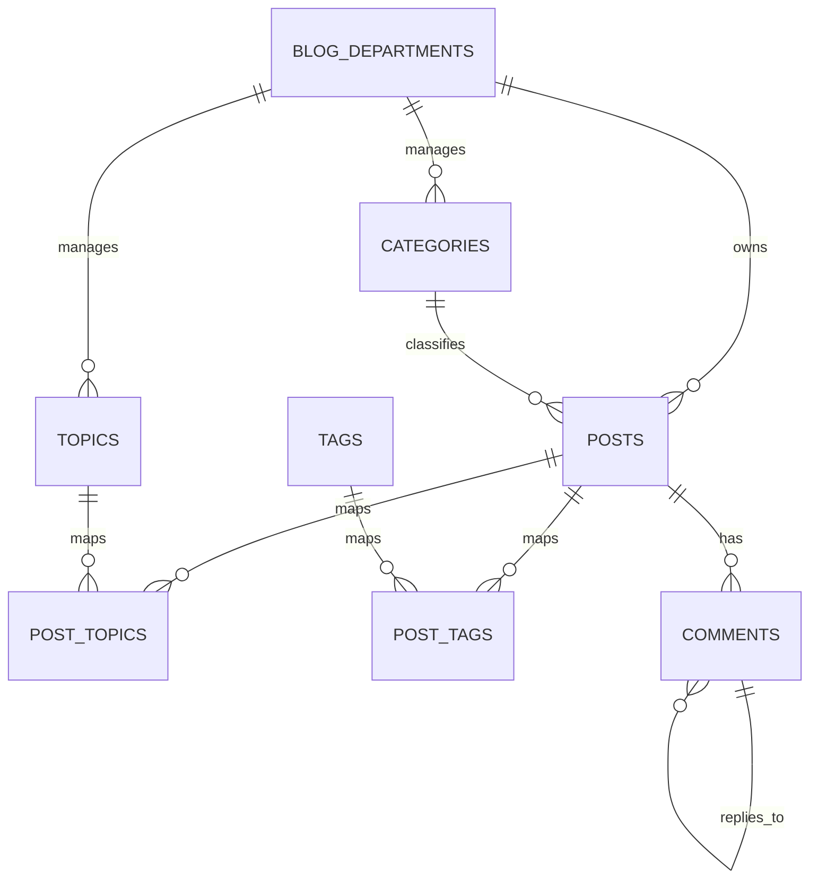

# Blog Data Relations

Tài liệu này giải thích mô hình dữ liệu của module `Blogs` theo cách dễ hiểu cho Frontend.

Mục tiêu của tài liệu:

- Giúp FE hiểu rõ từng DocType dùng để làm gì
- Giúp FE biết bài viết đang liên kết với `blog_departments`, `categories`, `topics`, `tags`, `comments` như thế nào
- Giúp FE hình dung dữ liệu cần lấy cho từng màn hình
- Giúp FE tránh nhầm giữa `category`, `topic`, `tag`

## 1. Tổng quan nghiệp vụ

Một bài viết trong hệ thống blog có các lớp dữ liệu chính:

- `blog_departments`: bộ phận quản lý nội dung
- `categories`: danh mục chính của bài viết, thuộc một `blog_department`
- `topics`: nhóm chủ đề nội bộ, thuộc một `blog_department`
- `tags`: nhãn tự do dùng chung toàn hệ thống
- `posts`: thực thể trung tâm của bài viết
- `comments`: bình luận của người dùng trên bài viết

Tư duy đơn giản:

- `department` trả lời câu hỏi: bài viết này do bộ phận nào quản lý?
- `category` trả lời câu hỏi: bài viết này thuộc nhóm nội dung chính nào?
- `topic` trả lời câu hỏi: trong phạm vi bộ phận đó, bài viết này thuộc những chủ đề nội bộ nào?
- `tag` trả lời câu hỏi: bài viết này có thể được gắn thêm các nhãn tự do nào để gom nhóm hoặc filter?

## 2. Danh sách DocType

Các DocType chính đang tham gia vào mô hình blog:

- `blog_departments`
- `categories`
- `topics`
- `tags`
- `posts`
- `post_topics`
- `post_tags`
- `comments`

DocType hiện có nhưng không dùng trong flow chính:

- `post-categories`

`post-categories` hiện chưa phải một phần của mô hình nghiệp vụ chính vì mỗi `post` chỉ có một `category` chính.

## 3. ERD tổng thể

## 3.1. ERD dạng text

```text
blog_departments 1 ------ n categories
blog_departments 1 ------ n topics
blog_departments 1 ------ n posts

categories       1 ------ n posts

posts            1 ------ n post_topics n ------ 1 topics
posts            1 ------ n post_tags   n ------ 1 tags
posts            1 ------ n comments

comments         1 ------ n comments
```

## 3.2. ERD dạng Mermaid



## 4. FE cần hiểu đúng 3 khái niệm `category`, `topic`, `tag`

Đây là phần quan trọng nhất vì FE rất dễ dùng nhầm:

### 4.1. `category`

- Là phân loại chính của bài viết
- Một bài viết chỉ có một `category`
- `category` thuộc về một `blog_department`
- Dùng tốt cho:
  - menu điều hướng
  - breadcrumb
  - filter chính
  - route segment
  - grouping danh sách bài viết

Ví dụ:

- `Thông báo`
- `Tin hoạt động`
- `Chính sách`

### 4.2. `topic`

- Là nhóm chủ đề nội bộ theo từng `blog_department`
- Một bài viết có thể có nhiều `topic`
- `topic` không dùng chung toàn hệ thống
- `topic` luôn phải cùng `department` với `post`
- Dùng tốt cho:
  - filter nâng cao trong phạm vi bộ phận
  - grouping nội dung chuyên môn
  - các block liên quan theo chủ đề nội bộ

Ví dụ:

- `Sự kiện`
- `Nội bộ`
- `Đào tạo`

### 4.3. `tag`

- Là nhãn linh hoạt dùng chung toàn hệ thống
- Một bài viết có thể có nhiều `tag`
- Một `tag` có thể gắn cho nhiều bài viết thuộc nhiều `department` khác nhau
- `tag` không bị ràng buộc theo `department`
- Dùng tốt cho:
  - search/filter mở
  - badge hiển thị trên card
  - trang tổng hợp theo tag
  - gợi ý bài liên quan theo keyword

Ví dụ:

- `Workshop`
- `Tin nóng`
- `AI`
- `Frappe`

## 5. Mô tả chi tiết từng DocType

## 5.1. `blog_departments`

Đây là bảng cha quản lý phạm vi dữ liệu của blog.

Field FE cần quan tâm:

- `name`: ID nội bộ của record
- `department_name`: tên bộ phận hiển thị ra UI
- `department_code`: mã bộ phận
- `description`: mô tả
- `is_active`: trạng thái sử dụng

Vai trò:

- Là owner của `categories`, `topics`, `posts`
- Cho FE biết bài viết thuộc bộ phận nào
- Có thể dùng làm filter cấp cao nhất nếu UI có chia nội dung theo phòng ban

Ví dụ:

```json
{
  "name": "8fd91a2c11",
  "department_name": "Phòng Truyền Thông",
  "department_code": "MEDIA",
  "description": "Quản lý tin tức và thông báo truyền thông",
  "is_active": 1
}
```

## 5.2. `categories`

Đây là danh mục chính của bài viết.

Field FE cần quan tâm:

- `name`
- `category`
- `department`
- `description`
- `is_active`
- `sort_order`
- `slug`

Quan hệ:

- Một `category` thuộc một `blog_department`
- Một `category` có nhiều `posts`

FE nên hiểu:

- Đây là field chính để render menu danh mục
- Nếu build route theo danh mục, nên dùng `slug` nếu có
- Chỉ hiển thị category active

Ví dụ:

```json
{
  "name": "4a1d728bb2",
  "category": "Thông báo",
  "department": "8fd91a2c11",
  "description": "Nhóm bài viết dạng thông báo chính thức",
  "is_active": 1,
  "sort_order": 10,
  "slug": "thong-bao"
}
```

## 5.3. `topics`

Đây là nhóm chủ đề nội bộ của từng bộ phận.

Field FE cần quan tâm:

- `name`
- `topic`
- `department`
- `desc`
- `is_active`
- `slug`

Quan hệ:

- Một `topic` thuộc một `blog_department`
- Một `topic` liên kết với `posts` qua `post_topics`

FE nên hiểu:

- Không lấy topic trực tiếp từ `posts`
- Muốn biết post có những topic nào phải đi qua bảng `post_topics`
- Chỉ hiển thị topic active

Ví dụ:

```json
{
  "name": "9c6f71a8ed",
  "topic": "Sự kiện",
  "department": "8fd91a2c11",
  "desc": "Các bài viết liên quan tới hoạt động và sự kiện",
  "is_active": 1,
  "slug": "su-kien"
}
```

## 5.4. `tags`

Đây là bảng nhãn linh hoạt dùng chung.

Field FE cần quan tâm:

- `name`
- `tag_name`
- `slug`
- `description`
- `is_active`

Quan hệ:

- Một `tag` liên kết với `posts` qua `post_tags`
- Không phụ thuộc `department`

FE nên hiểu:

- Có thể dùng tag như badge nhỏ trên UI
- Có thể xây trang listing theo tag
- Có thể dùng để suggest bài liên quan theo nhãn

Ví dụ:

```json
{
  "name": "2a7e9ab0b1",
  "tag_name": "Workshop",
  "slug": "workshop",
  "description": "Các bài viết liên quan workshop",
  "is_active": 1
}
```

## 5.5. `posts`

Đây là bảng trung tâm của toàn bộ blog.

Field FE cần quan tâm:

- `name`
- `title`
- `department`
- `category`
- `slug`
- `author`
- `published_at`
- `thumb`
- `thumb_desc`
- `excerpt`
- `status`
- `visibility`
- `view_count`
- `content`

Quan hệ:

- Một `post` thuộc một `blog_department`
- Một `post` thuộc một `category`
- Một `post` có nhiều `topic` qua `post_topics`
- Một `post` có nhiều `tag` qua `post_tags`
- Một `post` có nhiều `comments`

FE nên hiểu:

- `posts` là nguồn dữ liệu gốc cho list page và detail page
- `topics`, `tags`, `comments` là dữ liệu liên quan, không nằm trực tiếp trong record `post`
- Nếu build public page, thường sẽ filter:
  - `status = Published`
  - `visibility = Public`

Ví dụ:

```json
{
  "name": "e12a7fd921",
  "title": "Lịch công tác tuần 16",
  "department": "8fd91a2c11",
  "category": "4a1d728bb2",
  "slug": "lich-cong-tac-tuan-16",
  "author": "admin@example.com",
  "published_at": "2026-04-13 08:30:00",
  "thumb": "/files/banner-week-16.png",
  "thumb_desc": "Banner lịch công tác tuần 16",
  "excerpt": "Tổng hợp lịch công tác tuần 16 của bộ phận truyền thông.",
  "status": "Published",
  "visibility": "Public",
  "view_count": "124",
  "content": "<p>Nội dung chi tiết...</p>"
}
```

## 5.6. `post_topics`

Đây là bảng nối nhiều-nhiều giữa `posts` và `topics`.

Field:

- `post`
- `topic`

FE nên hiểu:

- Bảng này không phải dữ liệu render chính
- Đây là bảng trung gian để assemble dữ liệu topic của bài viết
- Muốn hiển thị topic của một bài:
  1. lấy tất cả record `post_topics` theo `post`
  2. join sang `topics`

Ví dụ:

```json
{
  "name": "1f92de7122",
  "post": "e12a7fd921",
  "topic": "9c6f71a8ed"
}
```

## 5.7. `post_tags`

Đây là bảng nối nhiều-nhiều giữa `posts` và `tags`.

Field:

- `post`
- `tag`

FE nên hiểu:

- Cách đọc giống `post_topics`
- Muốn lấy tags của bài viết thì phải đi qua `post_tags`

Ví dụ:

```json
{
  "name": "7b6de0d198",
  "post": "e12a7fd921",
  "tag": "2a7e9ab0b1"
}
```

## 5.8. `comments`

Đây là bảng bình luận.

Field FE cần quan tâm:

- `name`
- `post`
- `user`
- `comment_answer`
- `nội_dung`

Quan hệ:

- Một `comment` luôn thuộc một `post`
- `comment_answer` trỏ tới comment cha
- Nếu `comment_answer` rỗng thì đây là comment gốc
- Nếu `comment_answer` có giá trị thì đây là reply

Ví dụ:

```json
{
  "name": "cmt_001",
  "post": "e12a7fd921",
  "user": "user@example.com",
  "comment_answer": null,
  "nội_dung": "<p>Bài viết rất hữu ích</p>"
}
```

## 6. Ràng buộc dữ liệu FE cần biết

Đây là các rule backend đang dùng, FE nên hiểu để tránh gửi dữ liệu sai:

### 6.1. `posts`

- `department` là bắt buộc
- `category` là bắt buộc
- `category.department` phải bằng `post.department`
- Không cho dùng `category` inactive

### 6.2. `topics`

- `topic` phải thuộc đúng `blog_department`
- Không cho trùng `topic` trong cùng một `blog_department`
- Không cho dùng `topic` inactive khi gắn vào bài viết

### 6.3. `post_topics`

- Không cho trùng cặp `post + topic`
- `topic.department` phải bằng `post.department`

### 6.4. `tags`

- `tag` là global
- Không phụ thuộc `department`
- Không cho dùng `tag` inactive khi gắn vào bài viết

### 6.5. `post_tags`

- Không cho trùng cặp `post + tag`

## 7. FE nên lấy dữ liệu như thế nào

## 7.1. Trang danh sách bài viết

Mục tiêu:

- render card bài viết
- filter theo department
- filter theo category
- có thể hiển thị tags hoặc topics ngắn gọn

Nguồn dữ liệu chính:

- `posts`

Field tối thiểu FE cần:

- `name`
- `title`
- `slug`
- `thumb`
- `excerpt` hoặc `thumb_desc`
- `published_at`
- `view_count`
- `category`
- `department`

Nếu cần hiển thị thêm:

- `category` label: join `categories`
- `department` label: join `blog_departments`
- `tags`: lấy qua `post_tags -> tags`
- `topics`: lấy qua `post_topics -> topics`

## 7.2. Trang chi tiết bài viết

Nguồn dữ liệu:

- `posts`
- `categories`
- `blog_departments`
- `post_topics` + `topics`
- `post_tags` + `tags`
- `comments`

Data FE nên assemble:

```json
{
  "post": {},
  "department": {},
  "category": {},
  "topics": [],
  "tags": [],
  "comments": []
}
```

## 7.3. Trang lọc theo category

Cách hiểu:

- `post.category` là quan hệ trực tiếp
- Đây là kiểu filter đơn giản nhất

Điều kiện chính:

- `posts.category = <category_id>`
- nếu public page thì thêm:
  - `status = Published`
  - `visibility = Public`

## 7.4. Trang lọc theo topic

Cách hiểu:

- `posts` không có field `topic`
- phải đi qua `post_topics`

Luồng dữ liệu:

1. Lấy các record `post_topics` có `topic = <topic_id>`
2. Từ đó lấy danh sách `post`
3. Query `posts` theo danh sách đó

## 7.5. Trang lọc theo tag

Cách hiểu:

- `posts` không có field `tag`
- phải đi qua `post_tags`

Luồng dữ liệu:

1. Lấy các record `post_tags` có `tag = <tag_id>`
2. Từ đó lấy danh sách `post`
3. Query `posts` theo danh sách đó

## 7.6. Trang comments

Luồng dữ liệu:

1. Lấy toàn bộ `comments` theo `post`
2. Tách comment gốc:
   - `comment_answer = null`
3. Tách reply:
   - `comment_answer != null`
4. Group reply theo `comment_answer`
5. Render dạng tree hoặc thread

## 8. Payload FE nên mong đợi sau khi assemble

FE thường không render từng bảng riêng lẻ, mà sẽ assemble về object bài viết đầy đủ như sau:

```json
{
  "name": "e12a7fd921",
  "title": "Lịch công tác tuần 16",
  "slug": "lich-cong-tac-tuan-16",
  "thumb": "/files/banner-week-16.png",
  "excerpt": "Tổng hợp lịch công tác tuần 16 của bộ phận truyền thông.",
  "status": "Published",
  "visibility": "Public",
  "published_at": "2026-04-13 08:30:00",
  "view_count": "124",
  "department": {
    "name": "8fd91a2c11",
    "department_name": "Phòng Truyền Thông",
    "department_code": "MEDIA"
  },
  "category": {
    "name": "4a1d728bb2",
    "category": "Thông báo",
    "slug": "thong-bao"
  },
  "topics": [
    {
      "name": "9c6f71a8ed",
      "topic": "Sự kiện",
      "slug": "su-kien"
    },
    {
      "name": "b82e13fd0a",
      "topic": "Nội bộ",
      "slug": "noi-bo"
    }
  ],
  "tags": [
    {
      "name": "2a7e9ab0b1",
      "tag_name": "Workshop",
      "slug": "workshop"
    },
    {
      "name": "a6bc3e1290",
      "tag_name": "Tin nóng",
      "slug": "tin-nong"
    }
  ],
  "comments": [
    {
      "name": "cmt_001",
      "user": "user@example.com",
      "content": "<p>Bài viết rất hữu ích</p>",
      "replies": [
        {
          "name": "cmt_002",
          "user": "admin@example.com",
          "content": "<p>Cảm ơn bạn</p>"
        }
      ]
    }
  ]
}
```

## 9. FE nên cẩn thận ở đâu

### 9.1. Đừng nhầm `topic` với `tag`

- `topic` có `department`
- `tag` không có `department`
- `topic` mang nghĩa nội bộ theo bộ phận
- `tag` mang nghĩa mở, dùng để gắn nhãn tự do

### 9.2. Đừng giả định `posts` chứa sẵn mảng `topics` hoặc `tags`

Theo model hiện tại:

- `posts` chỉ giữ field chính của bài viết
- `topics` phải đi qua `post_topics`
- `tags` phải đi qua `post_tags`
- `comments` phải query riêng theo `post`

### 9.3. Với public page, nên filter visibility/status

Thông thường FE chỉ nên hiển thị:

- `status = Published`
- `visibility = Public`

### 9.4. Chỉ hiển thị record active

Nên ưu tiên chỉ dùng:

- `category.is_active = 1`
- `topic.is_active = 1`
- `tag.is_active = 1`
- `blog_department.is_active = 1`

## 10. Kết luận ngắn gọn cho FE

Nếu FE chỉ cần nhớ nhanh mô hình này, hãy nhớ 5 ý:

1. `posts` là bảng trung tâm.
2. `post.category` là phân loại chính và là quan hệ trực tiếp.
3. `topics` là nhãn nội bộ theo `blog_department`, phải đi qua `post_topics`.
4. `tags` là nhãn global, phải đi qua `post_tags`.
5. `comments` là bảng riêng và tự tham chiếu qua `comment_answer` để tạo reply tree.
